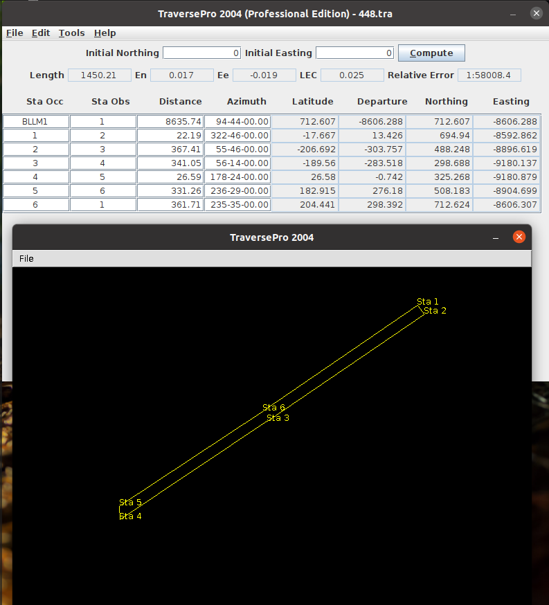
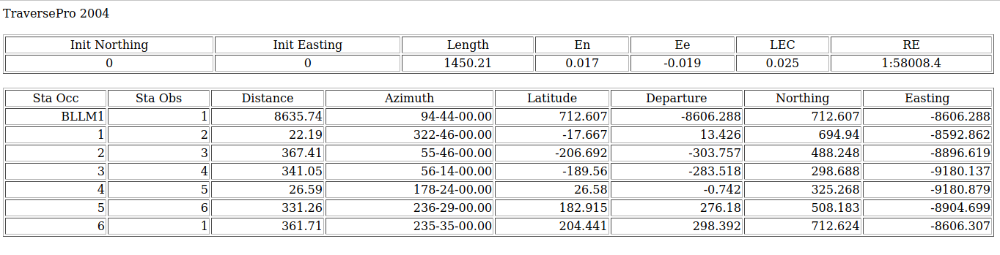

# traversepro
Closed Loop Traverse - A traverse that originates and terminates on a single point of known horizontal position

To create a jar file for the application:
`jar cfm TraversePro.jar Manifest.txt *.class`

To run the application:
`java -jar TraversePro.jar `
